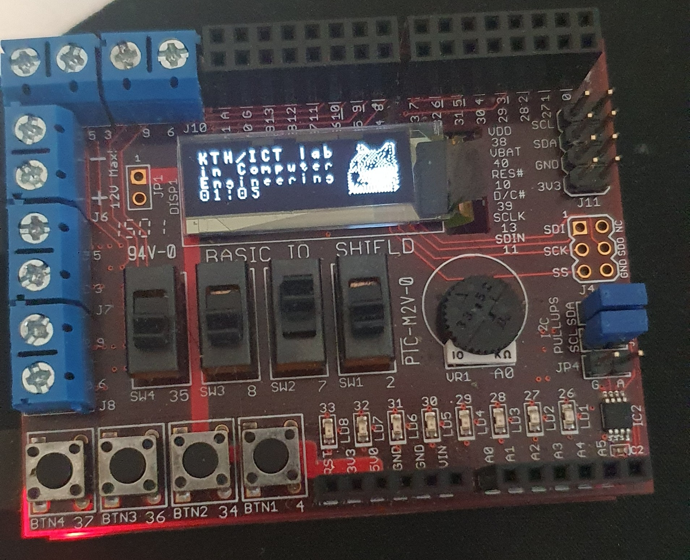
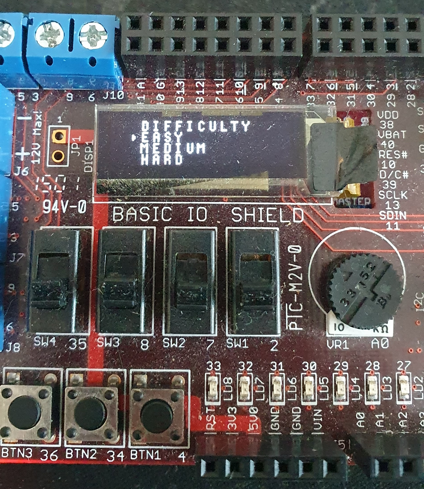
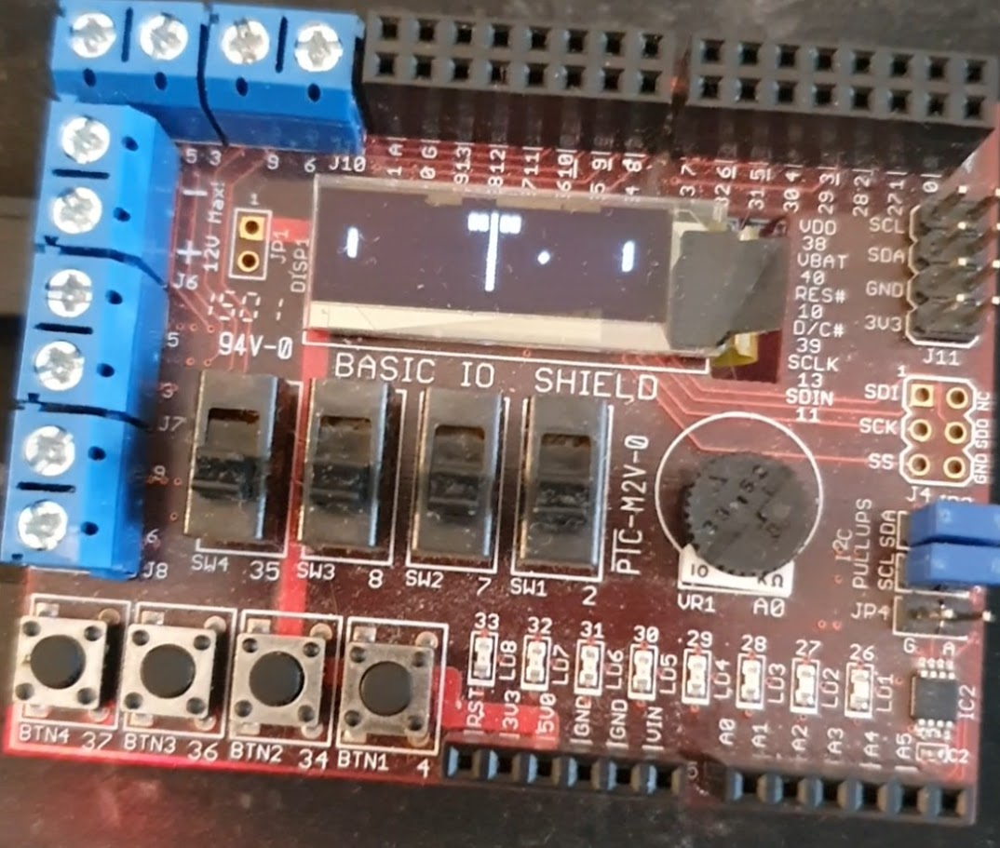
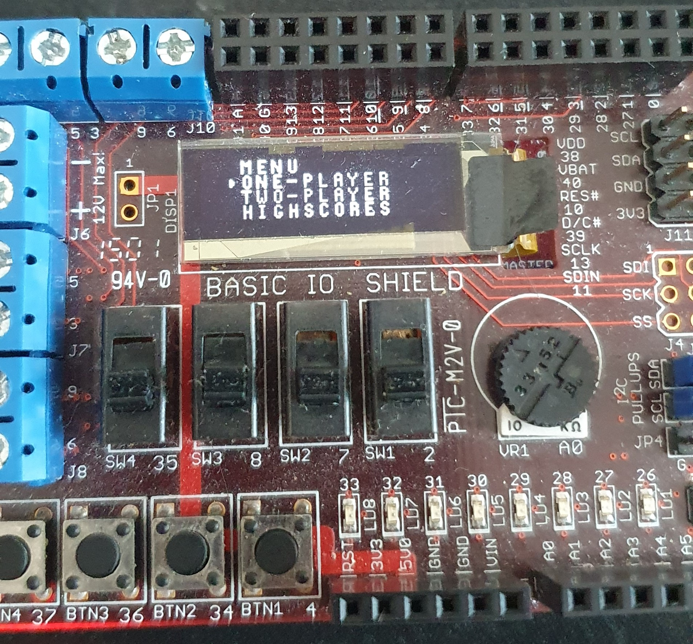

# chipkit-pong

This repository contains a take on the classic table-tennis themed game, [Pong](https://en.wikipedia.org/wiki/Pong). The game is written in C and assembly for the ChipKIT Uno32 board. 

